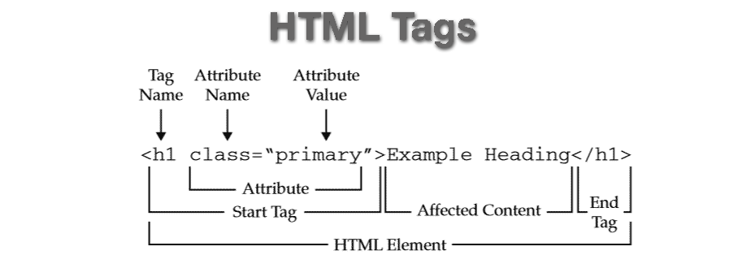
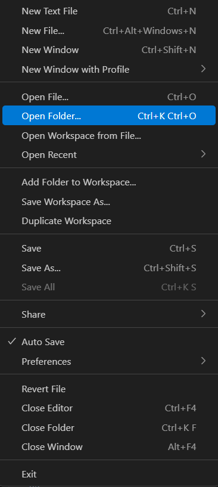
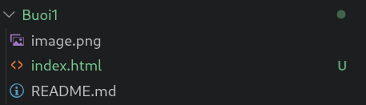
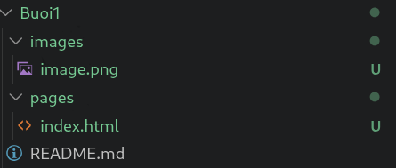
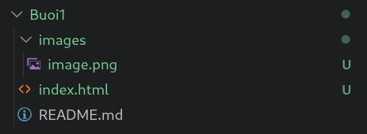
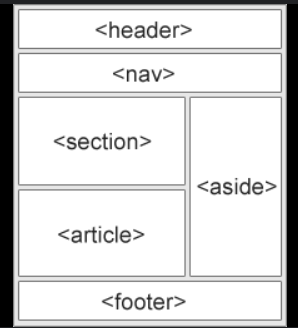

# Lộ trình lớp web public hè 2026

---

#### Buổi 1: Giới thiệu cài đặt IDE và Extensions

#### Buổi 2: Cấu trúc HTML cơ bản & Semantic HTML

#### Buổi 3: Giới thiệu CSS & Cách style cơ bản

#### Buổi 4: Làm việc với Font, Biến, Bộ chọn & Kỹ thuật chia layout với Flexbox

#### Buổi 5: CSS Grid, Position, Animation, Transition

#### Buổi 6: Giới thiệu về JavaScript và cách sử dụng JavaScript

#### Buổi 7: DOM là gì? Lắng nghe sự kiện và thao tác DOM

#### Buổi 8: Ôn tập tổng hợp & Kiểm tra cuối khóa

---

# HIT WEB PUBLIC 2026 - WEEK 2 

---

## Nội dung

### [I. Cấu trúc cơ bản của trang HTML](#i-cấu-trúc-cơ-bản-của-trang-html)

### [II. Các thẻ cơ bản trong HTML](#ii-các-thẻ-cơ-bản-trong-html)

[1. Cấu tạo của thẻ trong HTML](#1-cấu-tạo-của-thẻ-trong-html)

[2. Các thẻ cơ bản](#2-các-thẻ-cơ-bản)

### [III. Semantic HTML](#iii-semantic-html)


---

## I. Cấu trúc cơ bản của trang HTML

- 1 file HTML có phần đuôi mở rộng là `.html`
- Cấu trúc cơ bản của trang HTML thường gồm 3 phần:

  - `<!Doctype html>`: Đây là khai báo kiểu tài liệu, cho trình duyệt biết rằng tài liệu này sử dụng phiên bản HTML5.
  - `<html></html>`: Thẻ này bao bọc toàn bộ tài liệu HTML.
  - `<head></head>`: Phần này chứa các thông tin "meta" về trang, như tiêu đề trang, charset (mã hóa ký tự), viewport (đối với thiết bị di động), và liên kết đến các file CSS, JavaScript bên ngoài.
    - `<meta charset="UTF-8">`: Xác định mã hóa ký tự, thường sử dụng UTF-8.
    - `<meta name="viewport" content="width=device-width, initial-scale=1.0">`: Đảm bảo trang web hiển thị đúng trên thiết bị di động.
      → Mục đích của các thẻ `<meta>`: cung cấp thông tin về trang web cho trình duyệt từ đó cải thiện SEO (tối ưu hóa công cụ tìm kiếm)
    - `<title>`: Tiêu đề của trang web, xuất hiện trên tab của trình duyệt.
      ...
  - `<body></body>`: Phần chứa những nội dung hiển thị trên trang web

  ```html
  <!DOCTYPE html>
  <html>
    <head>
      <meta charset="UTF-8" />
      <meta name="viewport" content="width=device-width, initial-scale=1.0" />
      <title>Tiêu đề trang web</title>
    </head>

    <body>
      Phần thân đặt ở đây
    </body>
  </html>
  ```

## II. Các thẻ cơ bản trong HTML

### 1. Cấu tạo của thẻ trong HTML



- Cấu tạo:
  - `Tag name`: Tên các thẻ trong HTML được sử dụng để tạo ra các phần tử, thành phần trong web. Ví dụ: `<h1></h1>`, `<p></p>`, `<a></a>`,...
  - `Attribute`: Các thuộc tính sẽ cung cấp thêm thông tin cho các phần tử HTML
    - `Attribute name`: Tên thuộc tính
    - `Attribute value`: Gía trị của thuộc tính
  - `Content`: Các nội dung bên trong thẻ HTML
- Chú ý:
  - Các thẻ trong HTML thường có `Start tag` và `End tag`. Có một số thẻ chỉ có `End tag` hay còn gọi là `Self closing tag` ví dụ như thẻ ``
  - Các thuộc tính `Attribute` phải đặt trong `Start tag`. Còn các `Self closing tag` các thuộc tính đặt trong chính nó
  - `<h1>` đây gọi là 1 thẻ nhưng `<h1>Heading</h1>` được gọi là 1 thành phần HTML hay 1 Element HTML
- Vị trí: Các thẻ cơ bản này thường được đặt trong thẻ `<body></body>`
- Mục đích: Tạo ra các thành phần, phần tử trong trang web

### 2. Các thẻ cơ bản

Trước khi bắt đầu tìm hiểu các thẻ cơ bản, các bạn hãy thực hiện theo các bước sau đây để có thể mở thư mục `HIT_WEB_PUBLIC` trong VSCode

- B1: Mở VSCode
- B2:

  - Chọn `File` → Chọn `Open Folder` hoặc nhấn tổ hợp phím `Ctrl + K Ctrl + O`.

    

  - Một cửa sổ chọn thư mục hiện lên. Tìm đến chọn thư mục `HIT_WEB_PUBLIC` và nhấn `Add`


Nếu các bạn đã thêm được thư mục trên ,hãy tiếp tục thực hiện theo các bước dưới đây để tạo ra thư mục `week-2` và file `index.html` đầu tiên:

- B1: Tạo thư mục `week-2`
  - Click vào thư mục `HIT15_WEB_PRIVATE`
  - Click vào biểu tượng Folder


  - Tương tự như trên, click vào thư mục, đặt tên `index.html` và nhấn enter

Các bước ở trên là cách thêm 1 folder vào VS Code, cách tạo folder, tạo file trong VSCode. Lúc này hãy nhìn sang bên phải chính là phần editor của VSCode.


- Copy đoạn code cấu trúc cơ bản sau đây vào phần editor

```html
<!DOCTYPE html>
<html>
  <head>
    <meta charset="UTF-8" />
    <meta name="viewport" content="width=device-width, initial-scale=1.0" />
    <title>Tiêu đề trang web</title>
  </head>

  <body>
    Hello world
  </body>
</html>
```


- Nhấn chuột phải, chọn `Open with Live Server`. Sau khi thực hiện sẽ xuất hiện 1 trang web với chữ `Hello world` trên màn hình


❗ Một chút lưu ý:

- Kết quả trang web ở trên là nhờ vào extension `Live Server` đã cài ở buổi trước. Mỗi lần có sự thay đổi trong file `.html`, `.css` hay `.js`.
  Chỉ cần `Ctrl+S` lưu lại file thì trang web đang chạy live server sẽ tự động reload lại với mã nguồn mới nhất của bạn. Tránh việc phải mở file `index.html` thủ công trong folder
  Nếu như bạn nào chưa cài live server thì chưa thể thực hiện mở live server được
- Về cấu trúc cơ bản của HTML, các bạn thử xóa hết tất cả, gõ `!` và nhấn `Enter` hoặc `Tap`. Một cấu trúc cơ bản của HTML sẽ tự động được sinh ra trên màn hình. Hãy thử để biết kết quả nhé~

→ Như vậy, các bạn đã biết cách tạo 1 file `.html` và chạy `Live Server` để mở trang web của bạn. Chúng ta cùng tiếp tục tìm hiểu các thẻ cơ bản HTML, đi qua nội dung từng thẻ, hãy copy chúng và đặt vào trong `<body>Đặt ở đây</body>` để biết được kết quả hiển thị của nó sẽ như thế nào

##### 2.1. Thẻ tiêu đề `<h1>`, `<h2>`, `<h3>`, `<h4>`, `<h5>`, `<h6>`

- Các thẻ này được sử dụng để định nghĩa tiêu đề.
- Kích thước giảm dần từ h1 → h6

  ```html
  <h1>Heading 1</h1>
  <h2>Heading 2</h2> 
  <h3>Heading 3</h3>
  <h4>Heading 4</h4>
  <h5>Heading 5</h5>
  <h6>Heading 6</h6>
  ```

- Nguồn chi tiết hơn: 👉 [Ở đây!](https://www.w3schools.com/HTML/html_headings.asp)

##### 2.2. Thẻ văn bản <p>

- Được sử dụng để định nghĩa một đoạn văn bản

  ```html
  <p>This is a paragraph</p>
  ```

##### 2.3. Thẻ liên kết

- Được sử dụng để định nghĩa một liên kết

  ```html
  <a href="https://google.com">Google</a>
  ```

- Trong thẻ liên kết có 1 attribute cần thiết đó là `href` và đường dẫn sẽ đặt trong 2 dấu `" "`
- Bên cạnh đó thẻ liên kết này cũng có 1 attribute là `target` với 2 trong những giá trị như sau:
  - `_self`: Mặc định target của thẻ liên kết sẽ là `_self`. Khi đó đường liên kết đặt trong attribute `href` sẽ được mở ngay tại trang web của mình
  - `_target`: Khi mở đường liên kết, một trang web sẻ được mở ra tại tab mới.
    → Hãy thử cả hai giá trị trên để biết được kết quả.
- Gía trị của attribute `href` ngoài liên kết của 1 trang web còn có thể là: Email, Số điện thoại hoặc là một phần nội dung trên trang web của bạn
- Nguồn chi tiết hơn: 👉 [Ở đây!](https://www.w3schools.com/HTML/html_links.asp)

##### 2.4. Thẻ ảnh

- Được sử dụng để chèn ảnh lên trang web

  ```html
  
  ```

- Như các bạn có thể thấy, thẻ ảnh này là một `Self Closing Tag`
- Có một số thuộc tính trong thẻ ảnh như sau:
  - `src`: đây là thuộc tính chứa đường dẫn của ảnh
  - `alt`: đây là thuộc tính dùng để mô tả cho hình ảnh khi nó bị lỗi không thể hiển thị
  - `width`: đây là thuộc tính thiết lập chiều rộng cho hình ảnh
  - `height`: đây là thuộc tính thiết lập chiều cao cho mình ảnh
- Với đường dẫn của ảnh, có 3 cách như sau:

  - Cách 1 - Đường dẫn online: Đường dẫn của thuộc tính là một đường link online của ảnh.
    Bạn có thể lấy link ảnh online bằng cách nhấn chuột phải vào 1 ảnh online và chọn `Copy Image Link`. Hãy đặt đoạn html dưới đây vào body của bạn để biết được kết quả.

    ```html
    
    ```

    

  - Cách 2 - Đường dẫn tương đối: Đường dẫn của thuộc tính là một đường link tới hình ảnh đặt trong folder của bạn tùy thuộc vào vị trí tương đối của file HTML và ảnh.

    - Nếu file ảnh nằm cùng cấp với file `.html`, tức cùng cấp, bạn chỉ cần ghi tên file ảnh:
      Ví dụ như hình dưới đây có file `image.png` và file `index.html` cùng cấp

      

      ```html
      
      ```

    - Nếu folder của bạn có cấu trúc như hình ảnh dưới đây:

      

      Lúc này các bạn sử dụng `../` để quay lại thư mục cha chứa 2 folder `images` và `pages`, ở đây sẽ là thư mục `week-2`, sau đó tìm tới folder `images` → `image.png`

      ```html
      
      ```

    - Nếu file ảnh nằm trong folder cùng cấp với file `index.html`:

      

      Lúc này các bạn sử dụng `./` sẽ chỉ đến thư mục hiện tại chứa file `index.html`, tức folder `week-2`

      ```html
      
      ```

    ❗Bạn có thể sử dụng nhiều lần `../`. Hãy thử viết nó để biết kết quả như thế nào nhé.

- Nguồn chi tiết hơn: 👉 [Ở đây!](https://www.w3schools.com/HTML/html_images.asp)

##### 2.5. Thẻ danh sách

- Được dùng để định nghĩa một danh sách không có thứ tự (unorder list) và có thứ tự (order list)
  - Không có thứ tự (unorder list)
    ```html
    <ul>
      <li>Item 1</li>
      <li>Item 2</li>
      <li>Item 3</li>
    </ul>
    ```
  - Có thứ tự (order list)
    ```html
    <ol>
      <li>Item 1</li>
      <li>Item 2</li>
      <li>Item 3</li>
    </ol>
    ```
    ❗Chú ý:
  - Thẻ `<li>` là các item phải nằm trong thẻ `<ul>` hoặc `<ol>`
- Nguồn chi tiết hơn: 👉 [Ở đây!](https://www.w3schools.com/HTML/html_lists.asp)

##### 2.6. Thẻ bảng

- Được dùng để tổ chức các thông tin, dữ liệu thành một bảng có các hàng và cột
- Cấu trúc cơ bản của một bảng trong HTML sẽ như sau:
  ```html
  <table border="1">
    <tr>
      <th>Company</th>
      <th>Contact</th>
      <th>Country</th>
    </tr>
    <tr>
      <td>Alfreds Futterkiste</td>
      <td>Maria Anders</td>
      <td>Germany</td>
    </tr>
    <tr>
      <td>Centro comercial Moctezuma</td>
      <td>Francisco Chang</td>
      <td>Mexico</td>
    </tr>
  </table>
  ```
- Phân tích cấu trúc trên ta có:
  - Thẻ `<table>` bọc ngoài cùng là thẻ quyết định tạo nên một bảng
  - Có 1 thuộc tính là `border` được đặt trong thẻ mở của thẻ `<table>` và đặt bằng `1` để tạo viền cho bảng. Border càng lớn, viền càng dày
  - Thẻ `<tr>` dùng để định nghĩa hàng trong bảng
  - Thẻ `<td>` dùng để định nghĩa cột trong bảng
  - Thẻ `<th>` cũng tương tự như thẻ `<td>` nhưng nó để định nghĩa các ô là tiêu đề. Mặc định nội dung trong thẻ này sẽ được in đậm và căn giữa
- Bên cạnh đó còn có khác thẻ khác như sau:
  - `<thead>`: Dùng để nhóm phần tiêu đề của bảng
  - `<tbody>`: Dùng để nhóm phần thân của bảng
  - `<tfoot>`: Dùng để nhóm phân cuối, phân chân của bảng
    → Mục đích của những thẻ này để giúp đoạn html xây dựng bảng cụ thể, dễ nhìn hơn
- Đối với thẻ `<td>` và `<th>` còn có 2 thuộc tính như sau:

  - `colspan`: Thuộc tính này được dùng để gộp các cột với giá trị là số cột muốn gộp
    ```html
    <table border="1">
      <tr>
        <th colspan="2">Name</th>
        <th>Age</th>
      </tr>
      <tr>
        <td>Jill</td>
        <td>Smith</td>
        <td>43</td>
      </tr>
      <tr>
        <td>Eve</td>
        <td>Jackson</td>
        <td>57</td>
      </tr>
    </table>
    ```
  - `rowspan`: Thuộc tính này được dùng để gộp các hàng với giá trị là số hàng muốn gộp
    ```html
    <table border="1">
      <tr>
        <th>Name</th>
        <td>Jill</td>
      </tr>
      <tr>
        <th rowspan="2">Phone</th>
        <td>555-1234</td>
      </tr>
      <tr>
        <td>555-8745</td>
      </tr>
    </table>
    ```

- Nguồn tham khảo thêm: 👉 [Ở đây!](https://www.w3schools.com/HTML/html_tables.asp)

##### 2.7. Thẻ form

- Được dùng để tạo ra 1 form gồm các trường nhập dữ liệu.
- Một form được tạo bởi thẻ `<form>`. Bên trong nó có thể một trong những thẻ sau đây:

  - `<label>`: Được sử dụng để định nghĩa một nhãn cho một số thành phần của form
    Trong `<label>` có một thuộc tính là `for` nên được gán giá trị bằng thuộc tính `id` trong `<input>`,... để ràng buộc chúng với nhau
  - `<input>`: Đây là thẻ được sử dụng phần lớn trong form và nó cũng hiển thị theo nhiều cách dựa trên thuộc tính `type` của nó. Có thể liệt kê một số `type` như sau:

    - `text`: đây là `type` mặc định của ô nhập dữ liệu
      ```html
      <form>
        <label for="fname">First name:</label><br />
        <input type="text" id="fname" name="fname" /><br />
        <label for="lname">Last name:</label><br />
        <input type="text" id="lname" name="lname" />
      </form>
      ```
    - `password`:
      ```html
      <form>
        <label for="username">Username:</label><br />
        <input type="text" id="username" name="username" /><br />
        <label for="pwd">Password:</label><br />
        <input type="password" id="pwd" name="pwd" />
      </form>
      ```
    - `radio`:
      ```html
      <form>
        <input type="radio" id="html" name="fav_language" value="HTML" />
        <label for="html">HTML</label><br />
        <input type="radio" id="css" name="fav_language" value="CSS" />
        <label for="css">CSS</label><br />
        <input
          type="radio"
          id="javascript"
          name="fav_language"
          value="JavaScript"
        />
        <label for="javascript">JavaScript</label>
      </form>
      ```
    - `checkbox`:
      ```html
      <form>
        <input type="checkbox" id="vehicle1" name="vehicle1" value="Bike" />
        <label for="vehicle1"> I have a bike</label><br />
        <input type="checkbox" id="vehicle2" name="vehicle2" value="Car" />
        <label for="vehicle2"> I have a car</label><br />
        <input type="checkbox" id="vehicle3" name="vehicle3" value="Boat" />
        <label for="vehicle3"> I have a boat</label>
      </form>
      ```
      ...

  - `<select>`: Tạo ra một danh sách drop-down:

    ```html
    <label for="cars">Choose a car:</label>
    <select id="cars" name="cars">
      <option value="volvo">Volvo</option>
      <option value="saab">Saab</option>
      <option value="fiat">Fiat</option>
      <option value="audi">Audi</option>
    </select>
    ```

  - `<textarea>`: Tạo ra một trường nhập có thể nhập 1 đoạn văn nhiều dòng

    ```html
    <textarea name="message" rows="10" cols="30">
    The cat was playing in the garden.
    </textarea>
    ```

    - `rows`: thiết lập số dòng trong `textarea`
    - `cols`: thiết lập độ rộng của `textarea`

  - Nguồn chi tiết hơn: 👉 [Ở đây!](https://www.w3schools.com/html/html_form_elements.asp)

##### 2.8. Thẻ button

- Dùng để định nghĩa một nút button có thể bấm được

```html
<button type="button">Click Me!</button>
```

- Nguồn chi tiết hơn: 👉 [<button type="button">Click Me!</button>](https://www.w3schools.com/tags/tag_button.asp)

##### 2.9. Thẻ khối

- Được sử dụng như một thẻ bọc, nhóm các thành phần HTML với nhau
- `<div>` mặc định là một `block element`, tức là nó sẽ chiếm hết rộng của màn hình
- `<div>` không có thuộc tính attribute, nhưng có thể dùng `style`, `class`, `id`
- `<div>` thường được sử dụng để nhóm các thành phần HTML với nhau

```html
<div style="background-color: #FFF4A3">
  <h2>London</h2>
  <p>London is the capital city of England.</p>
  <p>London has over 13 million inhabitants.</p>
</div>
```

- Nguồn chi tiết hơn: 👉 [Ở đây!](https://www.w3schools.com/html/html_div.asp)

❗❗❗ Lưu ý:

- Bên cạnh những thẻ cơ bản như ở trên, trong HTML còn có rất nhiều thẻ khác, các bạn phải chủ động tìm hiểu xem nó như thế nào và các bạn có thể tham khảo 👉 [Ở đây!](https://www.w3schools.com/html/default.asp)
- Cách tìm kiếm trên gg: `tên thẻ` + tag in html


## III. Semantic HTML

  

  ## 🔍 Giải thích từng thẻ

### `<header>`
- Chứa phần đầu của trang hoặc một phần.
- Có thể bao gồm logo, tiêu đề, thanh tìm kiếm.

### `<nav>`
- Khu vực điều hướng, chứa các liên kết đến các trang khác.
- Thường nằm dưới header.

### `<section>`
- Đại diện cho một phần nội dung chính có liên quan.
- Dùng để nhóm nội dung có cùng chủ đề.

### `<aside>`
- Nội dung phụ trợ, không phải là phần chính.
- Ví dụ: quảng cáo, liên kết liên quan, bài viết nổi bật.

### `<article>`
- Một phần nội dung độc lập có thể tồn tại riêng biệt.
- Ví dụ: một bài blog, tin tức, thông báo.

### `<footer>`
- Phần chân trang.
- Thường chứa thông tin bản quyền, liên kết chính sách, thông tin liên hệ, mạng xã hội.

---

## ✅ Lợi ích của cách bố cục này:
- Giúp code rõ ràng, dễ bảo trì.
- Thân thiện với SEO.
- Hỗ trợ tốt cho người dùng sử dụng trình đọc màn hình.
---
- Semantic HTML hay còn biết đến là thẻ ngữ nghĩa trong HTML, giúp định nghĩa các thành phần cụ thể, rõ ràng hơn, xác định được mục đích, chức năng của chúng là để làm gì. Ví dụ như sau:
  - Với <b>`non-semantic`</b> ta có thẻ `<div>` hay `<span>`
  - Với <b>`semantic`</b> ta có thẻ như `<form>` hay `<table>`
- Chúng ta cũng có một số thẻ khác để định nghĩa các thành phần trong HTML như sau:

  - `<header>`: Đại diện cho phần đầu của một tài liệu hoặc một phần của tài liệu. Nó thường chứa nội dung giới thiệu hoặc các liên kết điều hướng như logo, tiêu đề, hoặc thanh điều hướng chính.

    ```html
    <header>
      <h1>Welcome to My Blog</h1>
      <nav>
        <ul>
          <li><a href="#home">Home</a></li>
          <li><a href="#about">About</a></li>
          <li><a href="#contact">Contact</a></li>
        </ul>
      </nav>
    </header>
    ```

  - `<nav>`: Đại diện cho một phần trên trang chứa các liên kết điều hướng. Nó thường chứa các menu hoặc danh sách liên kết dẫn đến các phần khác nhau trong website.

    ```html
    <nav>
      <ul>
        <li><a href="#services">Our Services</a></li>
        <li><a href="#portfolio">Portfolio</a></li>
        <li><a href="#contact">Contact Us</a></li>
      </ul>
    </nav>
    ```

  - `<footer>`: Đại diện cho phần cuối của một tài liệu hoặc một phần của tài liệu. Nó thường chứa thông tin về tác giả, bản quyền, liên kết đến chính sách bảo mật, hoặc thông tin liên hệ.

    ```html
    <footer>
      <p>&copy; 2024 My Website. All Rights Reserved.</p>
      <nav>
        <a href="#privacy-policy">Privacy Policy</a> |
        <a href="#terms">Terms of Service</a>
      </nav>
    </footer>
    ```

  - `<aside>`: Đại diện cho nội dung phụ liên quan đến nội dung chính của tài liệu. Thường được sử dụng cho sidebar, hiển thị thông tin bổ sung như quảng cáo, danh sách bài viết nổi bật, hoặc thông tin liên hệ.
  - `<section>`: Đại diện cho một phần hoặc một phân đoạn nội dung có liên quan trong tài liệu. Nó thường được dùng để nhóm các nội dung có cùng một chủ đề hoặc chức năng cụ thể.

❗❗❗ Giải thích những thẻ trên có vẻ dài dòng và khó hiểu nhưng những thẻ này cũng không khác gì so với thẻ `<div>` được thêm thuộc tính `id="header"` hoặc `class="header"`. Tuy nhiên với các thẻ ngữ nghĩa trên sẽ giúp đoạn HTML sẽ dễ đọc hơn và hiểu được nội dung bên trong nó là gì
