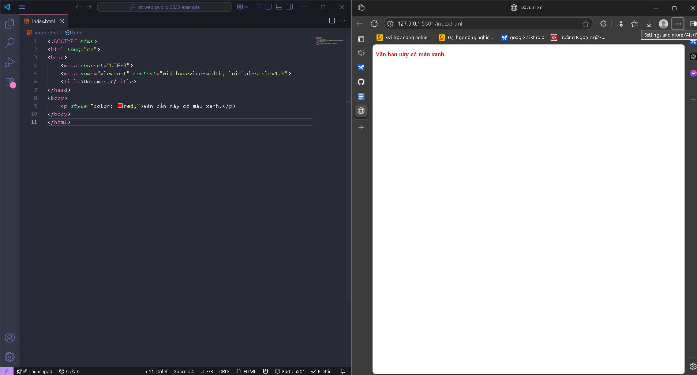
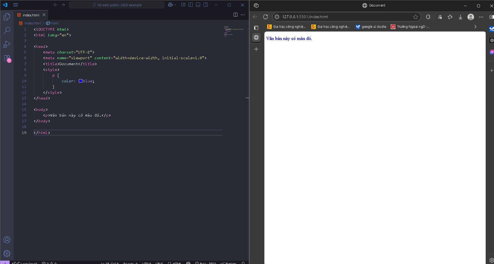
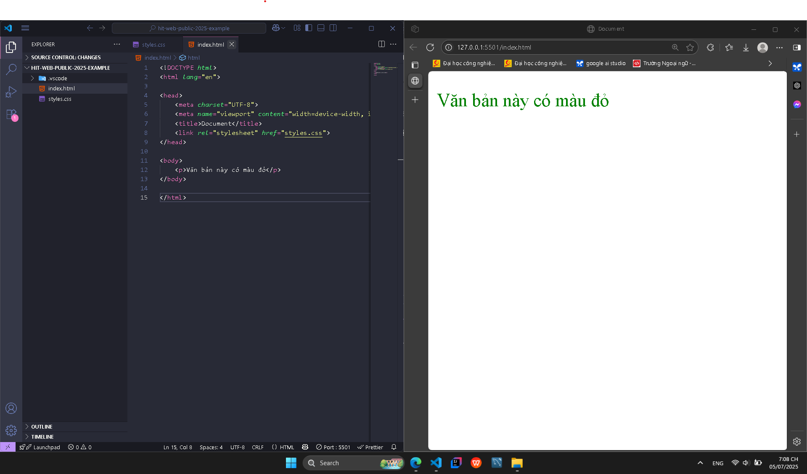
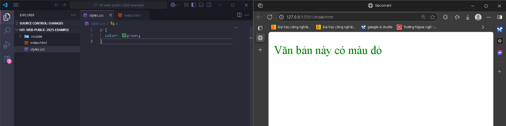
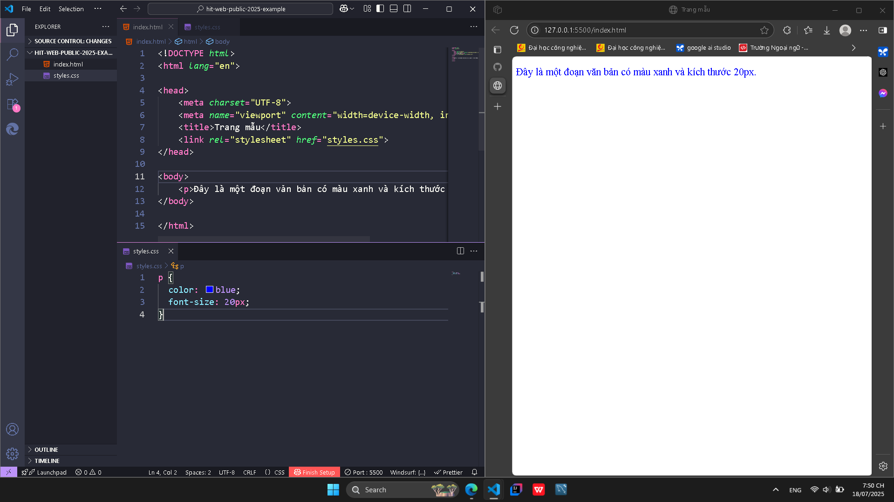
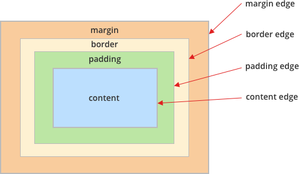
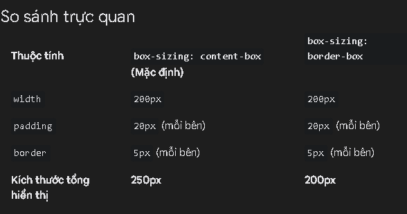
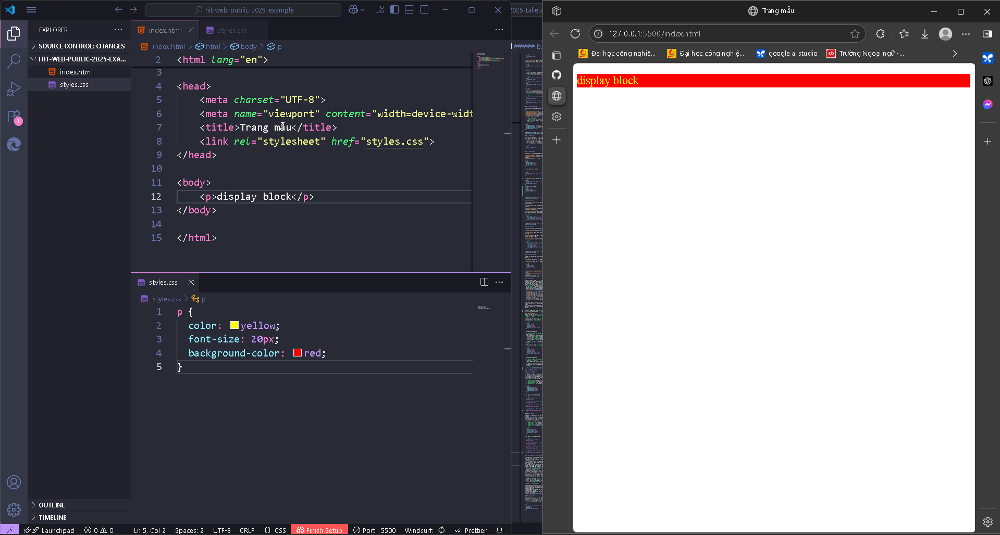
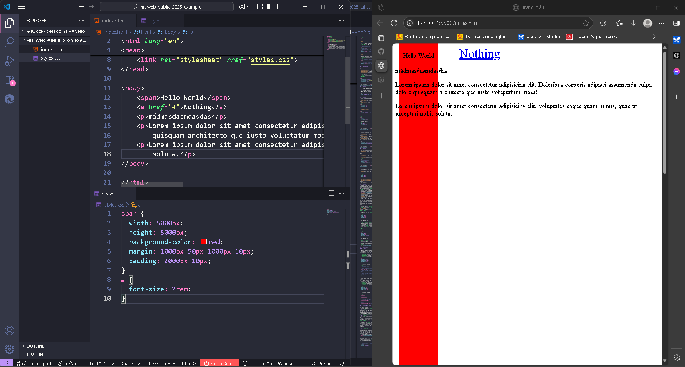
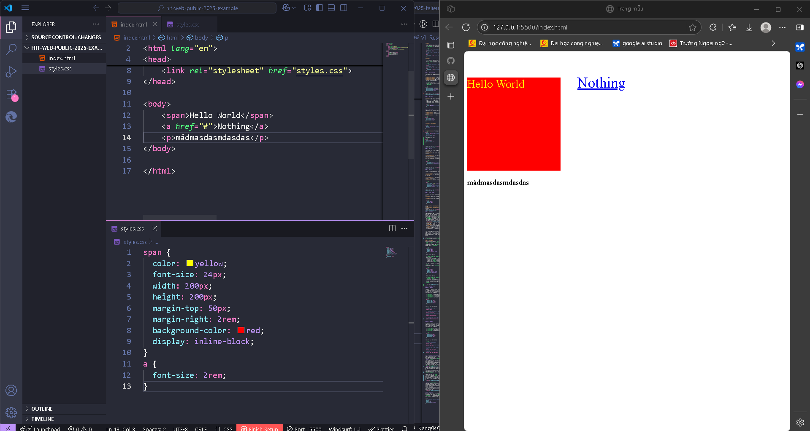

# Lộ trình lớp Web Public hè 2026

---

#### Buổi 1: Giới thiệu cài đặt IDE và Extensions

#### Buổi 2: Cấu trúc HTML cơ bản & Semantic HTML

#### Buổi 3: Giới thiệu CSS & Cách style cơ bản

#### Buổi 4: Làm việc với Font, Biến, Bộ chọn & Kỹ thuật chia layout với Flexbox

#### Buổi 5: CSS Grid, Position, Animation, Transition

#### Buổi 6: Giới thiệu về JavaScript và cách sử dụng JavaScript

#### Buổi 7: DOM là gì? Lắng nghe sự kiện và thao tác DOM

#### Buổi 8: Ôn tập tổng hợp & Kiểm tra cuối khóa

---

# HIT-WEB-PUBLIC-2026 - WEEK 3

## Nội dung

### [I. Giới thiệu CSS](#phan-1)
### [II. Chú thích trong CSS](#phan-2)
### [III. Các cách style trang web](#phan-3)
### [IV. Viết CSS như thế nào?](#phan-4)
### [V. Các thuộc tính CSS cơ bản](#phan-5)
### [VI. Reset CSS](#phan-6)

---

## <a id="phan-1"></a>I. Giới thiệu CSS

- CSS (Cascading Style Sheets) là ngôn ngữ dùng để mô tả cách hiển thị của các phần tử HTML (h1, table, p, . . .) trên trang web.
- Nó quyết định về bố cục, màu sắc, kiểu chữ, kích thước, khoảng cách giữa các phần tử, v.v. CSS giúp trang web đẹp hơn.

## <a id="phan-2"></a>II. Chú thích trong CSS


- Chú thích giúp giải thích mã nguồn và được trình duyệt bỏ qua.

- Để tạo chú thích một dòng hoặc nhiều dòng, sử dụng cú pháp `/* ........ */` hoặc nhấn **Ctrl + /**.

```css
/* Đây là một chú thích trong CSS */
```

## <a id="phan-3"></a>III. Các cách style trang web

Có 3 cách để áp dụng style vào trang web

### 1. Inline CSS

- Được viết trực tiếp trong thuộc tính style của thẻ HTML.
- Cách này tiện lợi cho các chỉnh sửa nhỏ và nhanh, nhưng không tối ưu cho dự án lớn.

```html
<p style="color: red;">Văn bản này có màu xanh.</p>
```



### 2. Internal CSS

- Được viết trong thẻ `<style>` bên trong phần `<head>` của trang HTML.
- Cách này tiện lợi cho các trang HTML đơn giản khi chỉ có một tệp HTML.

```html
<head>
  <style>
    p {
      color: blue;
    }
  </style>
</head>
```



### 3. External CSS

Được liên kết thông qua một file CSS riêng biệt, giúp quản lý CSS dễ dàng hơn:
Lúc này bạn sử dụng thẻ `link` đặt trong phần `head`, với giá trị của thuộc tính `href` là đường dẫn tới file `style.css`

```html
<head>
  <link rel="stylesheet" href="style.css" />
</head>
```

Trong file style.css:

```css
p {
  color: green;
}
```





### 4. So sánh mức độ sử dụng của 3 cách style css

- Inline css: sử dụng để test các thuộc tính css, hiếm khi sử dụng

- Internal css: sử dụng nếu các em muốn style trong file html cho tiện, không khuyến khích dùng.

- External css: đây là cách style được dùng nhiều nhất.

## <a id="phan-4"></a>IV. Viết CSS như thế nào?

- Có 2 phần, chọn được phần tử html mình muốn chọn và thêm thuộc tính mình muốn.

- Ta có file HTML như sau:

  ```html
  <!DOCTYPE html>
  <html lang="en">
    <head>
      <meta charset="UTF-8" />
      <title>Trang mẫu</title>
      <link rel="stylesheet" href="style.css" />
    </head>
    <body>
      <p>Đây là một đoạn văn bản có màu xanh và kích thước 20px.</p>
    </body>
  </html>
  ```

- Bước 1: Chọn 1 phần tử bạn cần style
  Nhìn đoạn html trên, tôi muốn style cho thẻ `p`. Tôi sẽ chọn thẻ `p`
  ```css
      p
  ```
- Bước 2: Mở ngoặc nhọn `{ }` cho khối quy tắc CSS. Bên trong ngoặc nhọn, bạn sẽ định nghĩa các thuộc tính để định dạng cho phần tử được chọn.
  ```css
  p {
    /* Các thuộc tính sẽ được viết ở đây */
  }
  ```
- Bước 3: Thêm thuộc tính và giá trị
  Bên trong ngoặc nhọn, bạn sẽ khai báo các thuộc tính (properties) và giá trị (values) tương ứng. Mỗi thuộc tính CSS xác định một phần của định dạng và cần có một giá trị đi kèm:
  - `color`: Đây là thuộc tính đặt màu cho văn bản của phần tử. Trong ví dụ này, bạn gán `blue` làm giá trị để đặt màu chữ là màu xanh.
    ```css
    color: blue;
    ```
  - `font-size`: Thuộc tính này xác định kích thước văn bản. Bạn đặt `20px`làm giá trị để làm cho kích thước chữ của phần tử `p` là 20px.
    ```css
    font-size: 20px;
    ```

❗Chú ý kết thúc mỗi thuộc tính bằng dấu chấm phẩy `;`
→ Ta có kết quả sau:

```css
p {
  color: blue;
  font-size: 20px;
}
```



## <a id="phan-5"></a>V. Các thuộc tính CSS cơ bản

#### 1. CSS Units (Đơn vị)

CSS hỗ trợ nhiều đơn vị đo lường, bao gồm cả đơn vị tuyệt đối (cố định) và tương đối (dựa vào phần tử hoặc màn hình).

- **px (pixel)**: Đơn vị cố định, biểu thị số pixel trên màn hình. Thường được dùng khi bạn muốn kích thước chính xác, không thay đổi theo kích thước màn hình hay phần tử cha

  ```css
  h1 {
    font-size: 24px;
  }
  ```

- **% (phần trăm)**: Đơn vị tương đối, thường được dùng để xác định kích thước tương đối so với phần tử cha.

  ```css
  div {
    width: 50%; /* Chiếm 50% chiều rộng của phần tử cha */
  }
  ```

- **em**:

  - Đơn vị tương đối, thường được dùng để xác định kích thước tương đối so với phần tử cha trực tiếp
  - `1em = 100%` kích thước font của phần tử cha.

  ```css
  /* Cỡ chữ của phần tử cha là 16px */
  div {
    font-size: 16px;
  }
  /* Phần tử con dùng đơn vị em nên 1.5em = 1.5 × 16px = 24px */
  p {
    font-size: 1.5em; /* Văn bản có kích thước 24px */
  }
  ```

- **rem**:

  - Đơn vị tương đối nhưng dựa vào kích thước font của phần tử gốc (html) thay vì phần tử cha trực tiếp.
  - `1rem = 100%` kích thước font của phần tử gốc (html).

  ```css
  /* Thiết lập cỡ chữ của phần tử gốc là 16px */
  html {
    font-size: 16px;
  }
  /* Dùng đơn vị rem nên 1.5rem = 1.5 × 16px = 24px */
  p {
    font-size: 1.5rem; /* Văn bản có kích thước 24px */
  }
  ```

#### 2. CSS Backgrounds

- Các thuộc tính CSS Background tác động tới nền của phần tử

- **background-color**: Đặt màu nền cho phần tử.
- **background-image**: Sử dụng ảnh làm nền.
- **background-repeat**: Xác định cách lặp lại ảnh nền.
- **background-size**: Đặt kích thước ảnh nền.
  Các giá trị phổ biến gồm:

  - `cover` (phủ kín)
  - `contain` (hiển thị toàn bộ trong phần tử).
  - 2 giá trị chiều rộng và chiều cao: `100% 50%` hoặc `300px 100px`

```css
div {
  background-color: lightblue;
  background-image: url("image.jpg");
  background-repeat: no-repeat; /* Không lặp lại ảnh nền */
  background-size: cover;
}
```

- Nguồn chi tiết hơn: 👉 [Ở đây!](https://www.w3schools.com/cssref/css3_pr_background.php)

#### 3. CSS Color

- **color**: Quy định màu cho văn bản. Có thể sử dụng tên màu, mã màu HEX, mã RGB hoặc mã HSL.

  - Tên màu (e.g., red, blue).
  - Mã màu HEX (e.g., #ff0000).
  - Mã màu RGB (e.g., rgb(255,0,0)).

  ```css
  p {
    color: #3498db; /* Màu xanh dương */
  }
  ```

#### 4. CSS Border

- Border là viền bao quanh phần tử, bao gồm ba thành phần:

- **border-width**: Độ dày của viền (px, em, rem).
- **border-style**: Kiểu viền (solid, dashed, dotted, double).
- **border-color**: Màu viền.

```css
div {
  border-width: 2px;
  border-style: solid;
  border-color: red;
}
```

- **Cú pháp short hand**:

```css
div {
  border: 2px solid red; /* Viền dày 2px, kiểu đường liền và màu đỏ */
}
```

- **border-radius**: Tạo bo góc cho viền.
```css
div {
  border: 2px solid red; /* Viền dày 2px, kiểu đường liền và màu đỏ */
  border-radius: 20px;
}
```
- Tạo thành hình tròn: 
```css
div {
  width: 100px;
  border-radius: 50%;
}
```


- Nguồn chi tiết hơn: 👉 [Ở đây!](https://www.w3schools.com/css/css_border.asp)

#### 5. CSS Text

- Các thuộc tính về văn bản giúp kiểm soát định dạng và căn chỉnh chữ.

- **text-align**: Căn lề văn bản (left, right, center, justify).

- **text-transform**: Biến đổi kiểu chữ (uppercase, lowercase, capitalize).

- **text-decoration**: Định dạng gạch chân, gạch ngang, bỏ gạch chân (underline, line-through, none).

  ```css
  p {
    text-align: center; /* Căn giữa văn bản */
    text-transform: uppercase; /* In hoa toàn bộ văn bản */
    text-decoration: line-through; /* Gạch ngang */
  }
  ```

- Nguồn chi tiết hơn: 👉 [Ở đây!](https://www.w3schools.com/css/css_text.asp)

#### 6. CSS Font

- Thuộc tính font điều chỉnh kiểu chữ của văn bản.

- **font-family**: Đặt font chữ cho văn bản.

- **font-size**: Kích thước font, có thể dùng đơn vị px, em, rem, %.

- **font-weight**: Độ đậm của chữ (normal, bold, hoặc giá trị số từ 100 đến 900).

- **font-style**: Kiểu chữ (italic, normal)

  ```css
  p {
    font-family: "Arial", sans-serif; /* Dùng phông chữ Arial và phông chữ không chân dự phòng */
    font-size: 24px;
    font-weight: bold; /* Đậm chữ */
    font-style: italic; /* Chữ nghiêng */
  }
  ```

- Nguồn chi tiết hơn: 👉 [Ở đây!](https://www.w3schools.com/css/css_font.asp)

#### 7. Width, Height

- Được sử dụng để tùy chỉnh chiều rộng hoặc chiều cao cho phần tử

- **width**: Chiều rộng của phần tử.

- **height**: Chiều cao của phần tử.

  ```css
  div {
    width: 200px;
    height: 100px;
  }
  ```

- **max-width**/ **max-height**: Set chiều rộng/ chiều cao tối đa
- **min-width**/ **min-height**: Set chiều rộng/ chiều cao tối thiểu
- Nguồn chi tiết hơn: 👉 [Ở đây!](https://www.w3schools.com/css/css_dimension.asp)

#### 8. Box Model

- Bất kỳ phần tử HTML nào của trang web đều được trình duyệt thể hiện dưới dạng một hình hộp chữ nhật. Ngay cả khi bạn chèn hình tròn, hình oval hay bo tròn các góc thì trình duyệt vẫn xem nó là một hình chữ nhật. Hình hộp chữ nhật này gồm 4 thành phần: `content`, `padding`, `border` và `margin`. Và tất cả chúng tạo nên cấu trúc Box model.
  → `Box Model` là một tập các quy tắc và công thức cộng trừ để giúp browser xác định được chiều rộng, cao (và một số thứ khác) của một element.
  

  - **Content**: Là nội dung chính của phần tử, nơi chứa văn bản hoặc hình ảnh.
  - **Padding**: Khoảng cách bên trong giữa content và border, tạo không gian xung quanh nội dung.
  - **Border**: Đường viền bao quanh phần tử, nằm giữa padding và margin.
  - **Margin**: Khoảng cách bên ngoài giữa phần tử này và các phần tử khác, là phần ngoài cùng trong Box Model.

```
Tổng chiều rộng = content width + padding left + padding right + border left + border right + margin left + margin right
Tổng chiều cao = content height + padding top + padding bottom + border top + border bottom + margin top + margin bottom
```

- Khi sử dụng thuộc tính `box-sizing: border-box;` `width` và `height` được style sẽ là `width` và `height` cuối cùng

**Ví dụ minh họa**
Giả sử bạn có một phần tử `<div>` và muốn nó có `width` là `200px` và `height` là `100px`, với `padding` là `20px` và `border` là `5px`.

- Trường hợp 1: Không dùng `box-sizing: border-box`; (giá trị mặc định là `content-box`)

  ```css
  div {
    width: 200px;
    height: 100px;
    padding: 20px;
    border: 5px solid black;
  }
  ```

  Trong trường hợp này:

  - `width`: `200px` và `height`: `100px` chỉ áp dụng cho phần content.
  - Kích thước tổng cộng của phần tử sẽ là:
    - Chiều rộng: `200px` (content) + `20px*2` (padding trái và phải) + `5px*2` (border trái và phải) = `250px`
    - Chiều cao: `100px` (content) + `20px*2` (padding trên và dưới) + `5px*2` (border trên và dưới) = `150px`

  => Phần tử sẽ chiếm kích thước tổng cộng là `250px x 150px`.

- Trường hợp 2: Dùng `box-sizing: border-box`;

  ```css
  div {
    width: 200px;
    height: 100px;
    padding: 20px;
    border: 5px solid black;
    box-sizing: border-box;
  }
  ```

  Trong trường hợp này:

  - `width`: `200px` và `height`: `100px` sẽ bao gồm cả `padding` và `border`.
  - Kích thước tổng cộng sẽ chính xác là `200px x 100px`

  => Điều này xảy ra vì trình duyệt sẽ tự điều chỉnh phần content bên trong để phù hợp với tổng kích thước `200px x 100px`.

    

#### 9. Padding, Margin

##### 9.1. Padding

- Padding là khoảng cách bên trong giữa nội dung (content) và đường viền (border) của phần tử.
- Padding giúp tạo không gian trống xung quanh nội dung bên trong phần tử, giúp nội dung không dính sát với border.
- Các thuộc tính của Padding

  - `padding-top`: Tạo khoảng cách ở phía trên nội dung.
  - `padding-right`: Tạo khoảng cách ở bên phải nội dung.
  - `padding-bottom`: Tạo khoảng cách ở phía dưới nội dung.
  - `padding-left`: Tạo khoảng cách ở bên trái nội dung.

  ```css
  div {
    padding-top: 10px;
    padding-right: 20px;
    padding-bottom: 30px;
    padding-left: 40px;
  }
  ```

- Cú pháp viết tắt Shorthand

  ```css
  /* Khoảng đệm bằng nhau ở cả bốn cạnh */
  padding: 20px;

  /* Khoảng đệm trên và dưới: 10px; trái và phải: 15px */
  padding: 10px 15px;

  /* Khoảng đệm trên: 10px; trái và phải: 15px; dưới: 20px */
  padding: 10px 15px 20px;

  /* Khoảng đệm trên: 10px; phải: 15px; dưới: 20px; trái: 25px */
  padding: 10px 15px 20px 25px; /* Các giá trị được tính theo chiều kim đồng hồ */
  ```

##### 9.2. Margin

- Margin là khoảng cách bên ngoài giữa phần tử và các phần tử khác.
- Margin giúp tạo không gian trống xung quanh phần tử, cách ly phần tử này với các phần tử khác.
- Các thuộc tính của Margin

  - `margin-top`: Tạo khoảng cách ở phía trên phần tử.
  - `margin-right`: Tạo khoảng cách ở bên phải phần tử.
  - `margin-bottom`: Tạo khoảng cách ở phía dưới phần tử.
  - `margin-left`: Tạo khoảng cách ở bên trái phần tử.

  ```css
  div {
    margin-top: 10px;
    margin-right: 20px;
    margin-bottom: 30px;
    margin-left: 40px;
  }
  ```

- Cú pháp viết tắt Shorthand

  ```css
  /* Lề ngoài bằng nhau ở cả bốn cạnh */
  margin: 15px;

  /* Lề ngoài trên và dưới: 10px; trái và phải: 15px */
  margin: 10px 15px;

  /* Lề ngoài trên: 10px; trái và phải: 15px; dưới: 20px */
  margin: 10px 15px 20px;

  /* Lề ngoài trên: 10px; phải: 15px; dưới: 20px; trái: 25px */
  margin: 10px 15px 20px 25px; /* Các giá trị được tính theo chiều kim đồng hồ */
  ```

#### 10. Display, Block, Inline, Inline-block

- Những thuộc tính này quyết định cách các phần tử HTML hiển thị trên trang web
- Các giá trị phổ biến của `display`
  ##### a. `block`
- Là các phần tử hiển thị theo dạng khối, chiếm toàn bộ chiều ngang của trang (100% chiều rộng), đẩy các phần tử khác xuống hàng mới.
- Các phần tử block tự động bắt đầu trên một dòng mới và có thể điều chỉnh chiều rộng và chiều cao
- Một số thẻ HTML mặc định hiển thị dạng block: `<div>`, `<p>`, `<h1>`, `<ul>`, `<li>`, v.v.
  
  ##### b. `inline`
- Không bắt đầu dòng mới, không chiếm toàn bộ chiều ngang mà chỉ chiếm không gian cần thiết vừa đủ với nội dung của nó.
- Các phần tử inline không bắt đầu trên một dòng mới và sẽ nằm cùng dòng với các phần tử khác.
- Một số thẻ HTML mặc định là inline: `<span>`, `<a>`, ``, `<label>`,..

- Không thể thay đổi `width` và `height`
- Chỉ có thể áp dụng `margin` theo chiều ngang (trái và phải) chứ không phải chiều dọc (trên và dưới).
- Về padding thì áp dụng được theo chiều ngang còn padding dọc về mặt thị giác là có xuất hiện, nhưng về mặt layout thì nó sẽ đè lên các phần tử khác, chứ không đẩy chúng ra xa
  

  ##### c. `inline-block`:

- Kết hợp đặc điểm của cả block và inline. Các phần tử inline-block hiển thị theo hàng với nội dung khác (như inline) nhưng vẫn có thể điều chỉnh kích thước (width và height) như block.
- Chiếm không gian vừa đủ cho nội dung, nhưng có thể điều chỉnh width và height.
- Có thể áp dụng padding, margin, và border cho cả chiều ngang và chiều dọc.
  

## <a id="phan-6"></a>VI. Reset CSS

- Reset CSS đặt lại các giá trị mặc định của trình duyệt cho các phần tử (như khoảng cách `margin`, `padding`, `font-size`,...), giúp tăng tính nhất quán khi hiển thị trên các trình duyệt khác nhau.
- Reset css thường được đặt ở đầu file
```css
* {
  /* Xóa lề ngoài, khoảng đệm và đường viền mặc định */
  margin: 0;
  padding: 0;
  box-sizing: border-box;
}
```
