# Lộ trình lớp Web Public hè 2026

#### Buổi 1: Giới thiệu cài đặt IDE và Extensions

#### Buổi 2: Cấu trúc HTML cơ bản & Semantic HTML

#### Buổi 3: Giới thiệu CSS & Cách style cơ bản

#### Buổi 4: Làm việc với Font, Biến, Bộ chọn & Kỹ thuật chia layout với Flexbox

#### Buổi 5: CSS Grid, Position, Animation, Transition

#### Buổi 6: Giới thiệu về JavaScript và cách sử dụng JavaScript

#### Buổi 7: DOM là gì? Lắng nghe sự kiện và thao tác DOM

#### Buổi 8: Ôn tập tổng hợp & Kiểm tra cuối khóa

---

# HIT-WEB-PUBLIC-2026 - WEEK 4

## Nội dung

### [I. CSS Selector](#css-selector-1)

### [II. Thứ tự ưu tiên CSS](#ii-thứ-tự-ưu-tiên-css-1)

### [III. CSS Variables](#iii-css-variables-1)

### [IV. Quy tắc đặt tên BEM](#iv-quy-tắc-đặt-tên-bem-1)

### [V. Nhúng Icon, nhúng Font](#v-nhúng-icon-nhúng-font-1)

### [VI. Các khái niệm cơ bản trong Flexbox](#vi-các-khái-niệm-cơ-bản-trong-flexbox)

### [VII. Thuộc tính Flexbox](#vii-thuộc-tính-flexbox)

---

## I. CSS Selector

**CSS Selector** là cách chúng ta chọn phần tử HTML để áp dụng CSS

CSS selector sinh ra là để chọn được phần tử mình mong muốn một cách dễ dàng

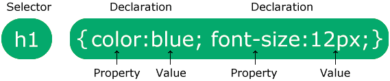

Hình ảnh ở trên chính là cách viết CSS và chúng ta đã tìm hiểu sơ qua tại [Week 3](../week-3/README.html)

👉 Tham khảo: [CSS Selectors](https://www.w3schools.com/cssref/css_selectors.php)

### 1. Selector cơ bản:

```html
<h1 id="heading">buoi4</h1>
<h1>buoi4</h1>
<p>Lorem ipsum dolor sit amet.</p>
<p class="text">
  Lorem ipsum dolor sit amet consectetur adipisicing elit. Rerum, expedita.
</p>
```

- **Element Selector**: chọn tất cả các phần tử có tên là `element`

  ```css
  p {
    color: red;
  }
  ```

- **ID Selector**: chọn phần tử có `id` là `heading`

  ```css
  #heading {
    font-size: 36px;
    color: blue;
  }
  ```

- **Class Selector**: chọn tất cả các phần tử có `class` là `text`

  ```css
  .text {
    text-decoration: line-through;
    color: pink;
  }
  ```

- **Universal Selector**: chọn tất cả các phần tử

  ```css
  * {
    margin: 0;
    padding: 0;
    font-style: italic;
    box-sizing: border-box;
  }
  ```

### 2. Selector kết hợp

- Như tên gọi, phần này ta học cách kết hợp các selector cơ bản thông qua các selector kết hợp

```html
<div class="wrapper">
  <div class="heading">
    <h1 class="title">Title</h1>
    <h2 class="sub-title">Sub title</h2>
  </div>
  <div class="content">
    <p class="para first-para">First paragraph</p>
    <p class="para second-para">Second paragraph</p>
    <p class="third-para">Third paragraph</p>
  </div>
</div>
<p>
  Lorem ipsum dolor sit amet consectetur adipisicing elit. Voluptatum, nulla!
</p>
```

#### 2.1. **Grouping Selector**: chọn tất cả các phần tử có tên là `element1` hoặc `element2` hoặc `element3`

Chúng ta sử dụng **Grouping Selector** khi bạn muốn các phần tử có cùng thuộc tính nào đó

Bình thường chúng ta sẽ style như thế này:

```css
h1 {
  color: red;
}
h2 {
  color: red;
}
p {
  color: red;
}
```

Tuy nhiên cách này khá là dài, chúng ta có 1 cách khác

```css
h1,
h2,
p {
  color: red;
}
```

#### 2.2. Descendant Selector: chọn tất cả các phần tử con của phần tử có tên là element

Trong đó phần tử con là toàn bộ các thẻ con, cháu, chắt, chút chít bên trong thẻ đấy, trong ví dụ dưới đây là các thẻ p

Có 1 trường hợp trong đoạn `html` trên xảy ra như thế này. Chúng ta muốn nội dung trong thẻ `p` trong thẻ `div` có `class="content"` có màu `blue`. Chúng ta sẽ áp dụng **`Element Selector`** như thế này:

```css
p {
  color: blue;
}
```

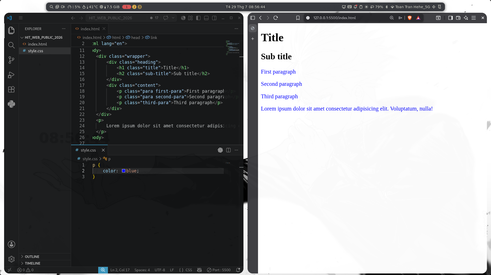

Lúc này xảy ra tình huống ngoài mong muốn đó là thẻ `p` ngoài thẻ thẻ `div` có `class="content"` cũng nhận màu `blue`.

Để xử lý vấn đề này chúng ta sẽ sử dụng **`Descendant Selector`** kết hợp cùng **`Class Selector`** như thế này:

```css
.content p {
  color: blue;
}
```

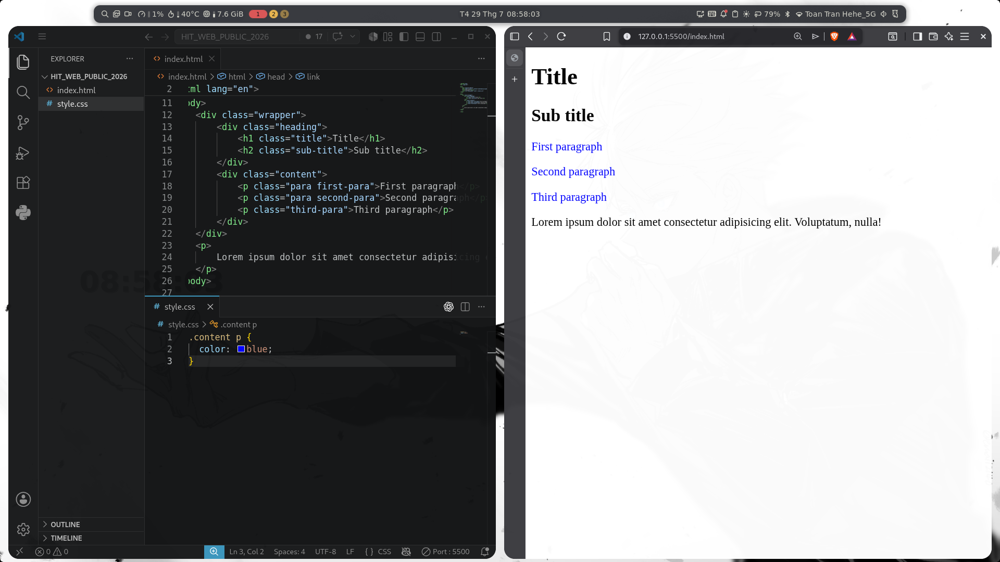

Như bức ảnh ở trên, chúng ta đã có thể áp dụng màu chữ `blue` cho thẻ `p` trong thẻ `div` có `class="content"`

#### 2.3. Child Selector: chọn tất cả các phần tử con trực tiếp của phần tử có tên là element


- Trong đó phần tử con trực tiếp là chỉ tính các thẻ con , không tính các thẻ cháu, chắt , chút , chít, ....
- Trong ví dụ dưới thẻ con trực tiếp là 2 thẻ div , thẻ p

Trong trường hợp này chúng ta muốn màu chữ của thẻ `p` cuối cùng như này có màu xanh thì sao?
```html
<div class="wrapper">
  <div class="heading">
    <h1 class="title">Title</h1>
    <h2 class="sub-title">Sub title</h2>
  </div>
  <div class="content">
    <p class="para first-para">First paragraph</p>
    <p class="para second-para">Second paragraph</p>
    <p class="third-para">Third paragraph</p>
  </div>
  <p>Đây là thẻ con trực tiếp !</p>
</div>
```
Với cách đầu tiên chúng ta có thẻ đặt `class` cho thẻ `p` đó và style cho nó bằng cách sử dụng **`Descendant Selector`** kết hợp với **`Class Selector`** như ví dụ trên
Còn một cách nữa đó là sử dụng **`Child Selector`** như sau:
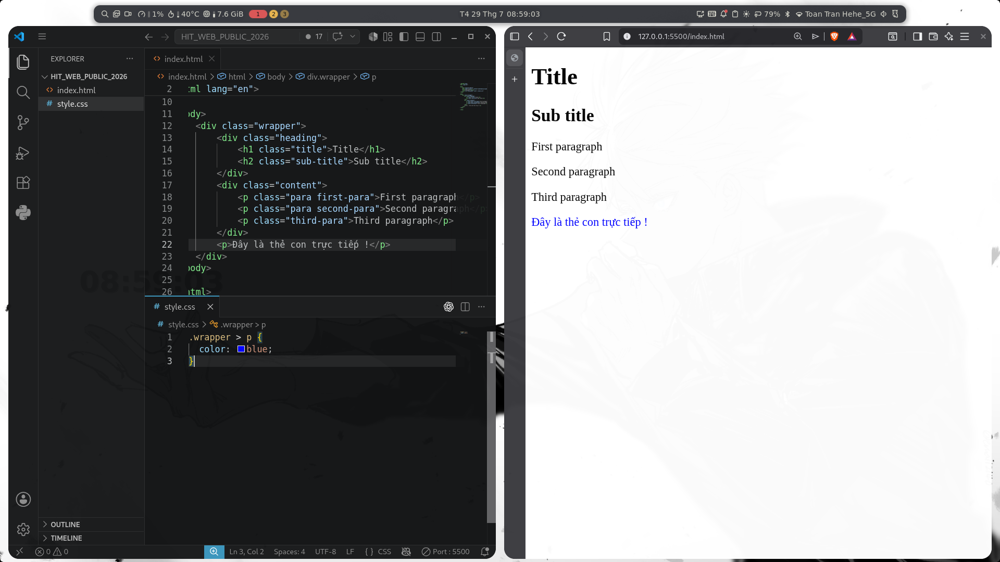

Tại sao lại có kết quả như trên vì các thẻ `p` trong thẻ `div` có `class="content"` không phải là phần tử con trực tiếp của thẻ `div` có `class="wrapper"`

#### 2.4. Sibling Selector

- **Adjacent Sibling Selector**: chọn phần tử cùng cấp đầu tiên sau phần tử có tên là `element`
  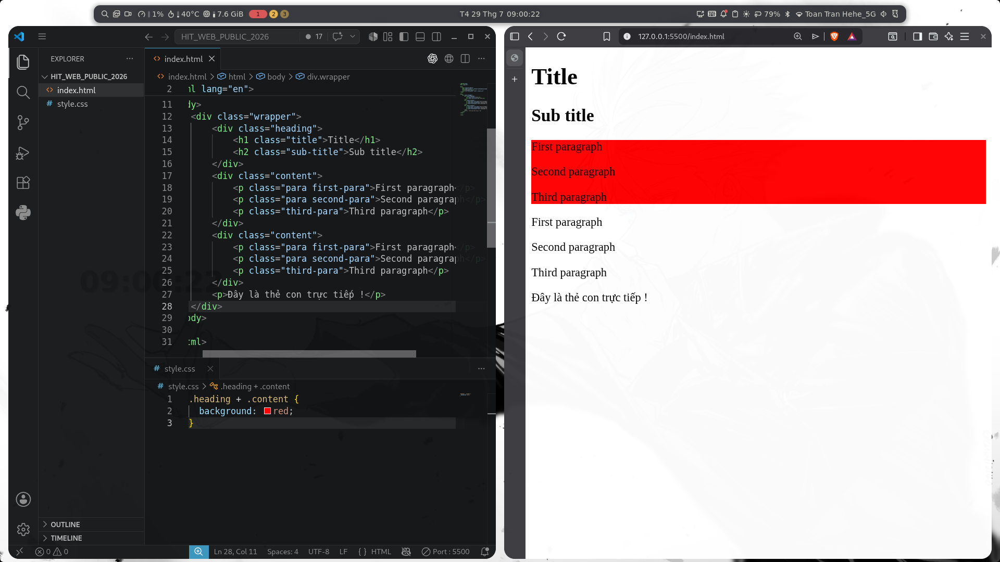
  Như hình ảnh ở trên có 2 thẻ `div` có `class="content"`. Tuy nhiên tôi chỉ muốn thẻ `div` đầu tiên cùng cấp ngay sau thẻ `div` có `class="heading"` có nền màu đỏ, tôi sẽ áp dụng style như sau:

  ```css
  .heading + .content {
    background: red;
  }
  ```

  Lúc này thẻ `div` có `class="content"` cùng cấp ngay sau thẻ `div` có `class="heading"` sẽ nhận màu nền là màu đỏ

- **General Sibling Selector**: chọn tất cả các phần tử cùng cấp sau phần tử có tên là `element`
  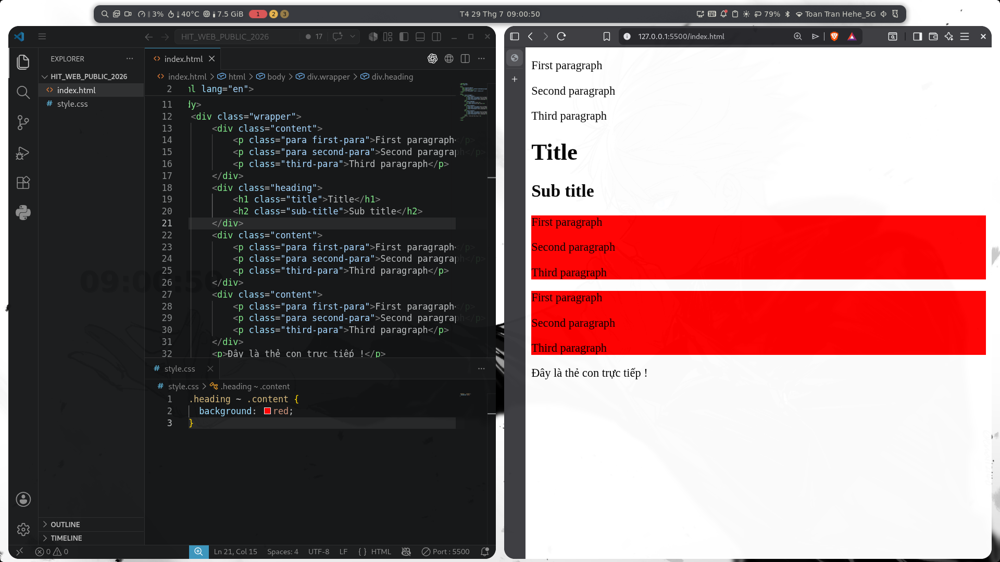
  Khác với trường hợp ở trên, ta muốn tất cả các thẻ `div` có `class="content"` ngay sau thẻ `div` có `class="heading"` có nền màu đỏ, ta chỉ việc thay đổi từ dấu `+` qua dấu `~`
  ```css
  .heading ~ .content {
    background: red;
  }
  ```

#### 2.5. Pseudo-class Selector: chọn phần tử trong trạng thái cụ thể

```html
<ul class="wrap">
  <li class="item">Item 1</li>
  <li class="item">Item 2</li>
  <li class="item">Item 3</li>
  <li class="item">Item 4</li>
  <li class="item">Item 5</li>
</ul>
```

Giả sử chúng ta có 1 đoạn html ở trên. Chúng ta muốn css cho đúng một thẻ `li` trong thẻ `ul`. Lúc này chúng ta không thể nào áp dụng được **`Element Selector`** hay **`Class Slector`**. Để có thể làm được điều đó, chúng ta hãy cùng nhau đi qua các nội dung sau đây

- Sử dụng **`:first-child`** để chọn phần tử đầu tiên

  

  ```css
  .wrap .item:first-child {
    color: red;
  }
  ```

  Hình ảnh ở trên chính là cách áp dụng style cho thẻ `li` có `class="item"` là phần tử con đầu tiên của thẻ `ul`

- Sử dụng **`:last-child`** để chọn phần tử cuối cùng
  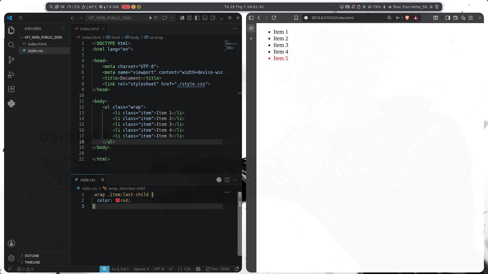

  ```css
  .wrap .item:last-child {
    color: red;
  }
  ```

  Trái ngược với **`:first-child`** ở trên sẽ lựa chọn phần tử đầu tiên thì **`:last-child`** sẽ lựa chọn phần tử con cuối cùng trong thẻ `ul`

- Sử dụng **`:nth-child(n)`** để chọn phần tử thứ `n`

  Ngoài chọn phần tử đầu tiên và cuối cùng, chúng ta còn cách để chọn cụ thể một phần tử thứ `n`

  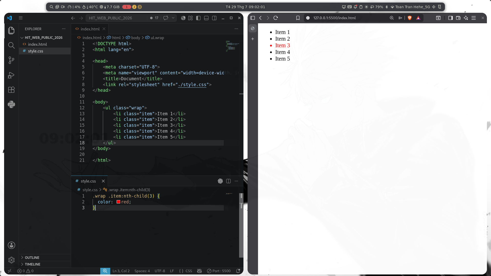

  ```css
  .wrap .item:nth-child(3) {
    color: red;
  }
  ```

  Ở hình ảnh trên là cách chúng ta áp dụng để chọn được phần tử `li` thứ 3 có `class="item"`

- Sử dụng **`:not(selector)`** để chọn tất cả các phần tử không phải là `selector`

  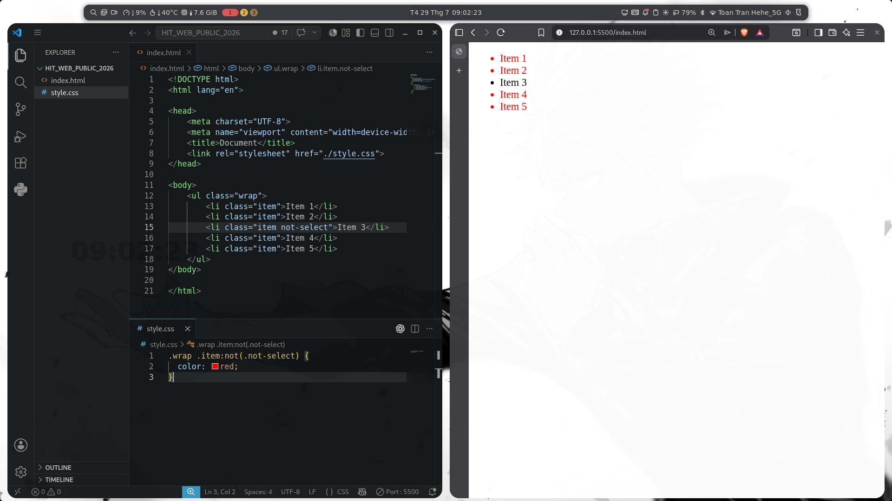

  ```css
  .wrap .item:not(.not-select) {
    color: red;
  }
  ```

  Hình ảnh ở trên chính là cách chúng ta muốn các thẻ khác sẽ nhận màu đỏ, còn thẻ `li` có `class="item not-select" sẽ không nhận màu đỏ

Bên cạnh các **`Pseudo-class Selector`** trên, chúng ta có thêm một số cách style khi chúng ta di chuyển chuột vào 1 phần tử.

```html
<!DOCTYPE html>
<html lang="en">
  <head>
    <meta charset="UTF-8" />
    <meta name="viewport" content="width=device-width, initial-scale=1.0" />
    <title>Document</title>
    <link rel="stylesheet" href="style.css" />
  </head>
  <body>
    <button>Click me</button>
  </body>
</html>
```

```css
button {
  font-size: 32px;
  padding: 8px 16px;
}

button:hover {
  background: blue;
  color: white;
}
```

- Sử dụng **`:hover`** để chọn phần tử sẽ được style khi di chuột vào
- Các bạn hãy tự mình trải nghiệm để biết kết quả như thế nào nhé

👉 Tham khảo thêm [Tại đây](https://www.w3schools.com/css/css_pseudo_classes.asp)

## II. Thứ tự ưu tiên CSS

Thứ tự ưu tiên trong CSS (CSS specificity) là quy tắc quyết định thứ tự áp dụng các thuộc tính CSS khi có nhiều quy tắc cùng ảnh hưởng đến một phần tử.

| **Selector** | **Thứ tự ưu tiên** | **Điểm** |
| :----------: | :----------------: | :------: |
|  !important  |         1          |    ♾️    |
| inline style |         2          |   1000   |
|      id      |         3          |   100    |
|    class     |         4          |    10    |
|   element    |         5          |    1     |

##### - **!important**

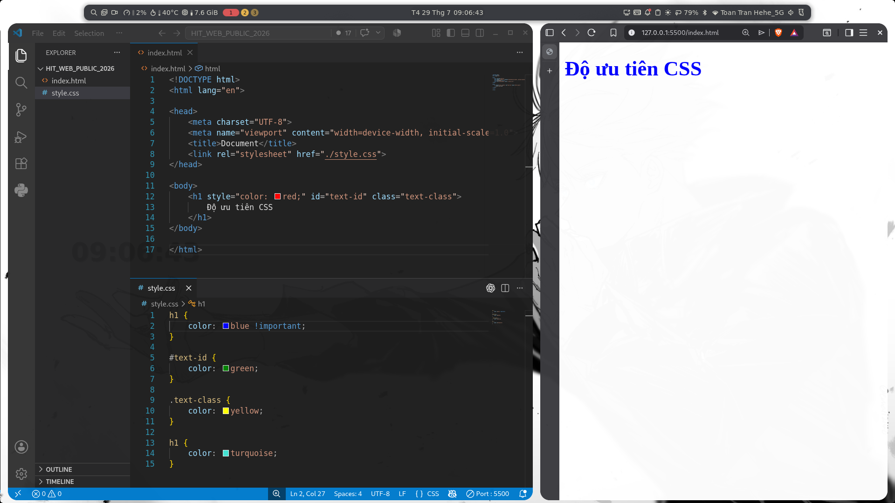

##### - **inline style**

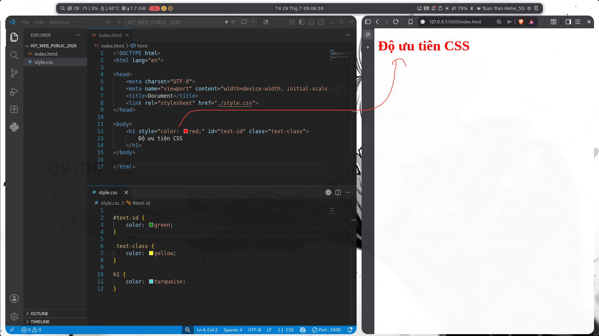

##### - **id**

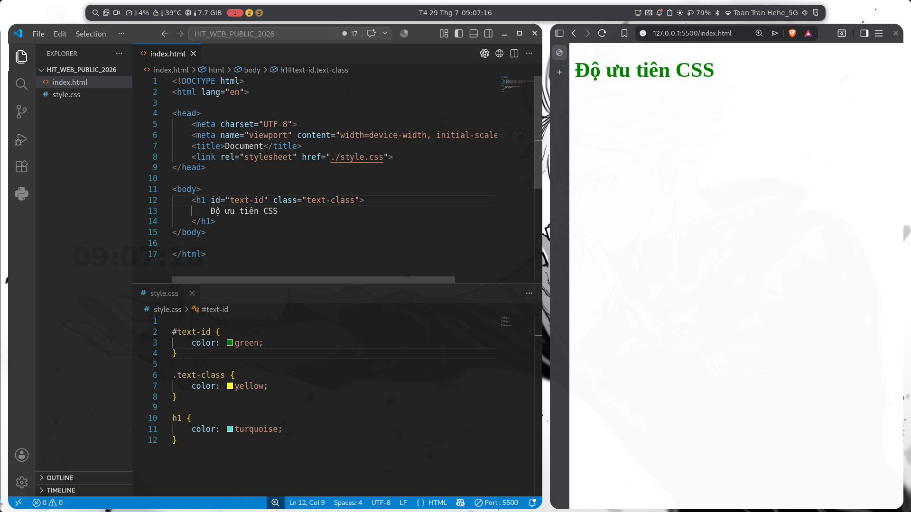

##### - **class**

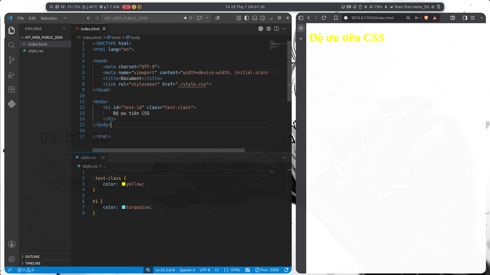

👉 Tham khảo [Tại đây](https://www.w3schools.com/css/css_specificity.asp)

## III. CSS Variables

- **CSS Variables** là các biến được định nghĩa trong CSS để lưu trữ các giá trị có thể tái sử dụng, chẳng hạn như màu sắc, font-size, hoặc bất kỳ thuộc tính nào khác.

- Sử dụng **CSS Variables** giúp bạn dễ dàng thay đổi và quản lý các giá trị này trong toàn bộ tài liệu CSS mà không cần phải chỉnh sửa từng nơi sử dụng chúng.

- Cách sử dụng:

  - CSS Variables được khai báo bằng cách sử dụng dấu gạch ngang kép `(--)` trước tên biến
  - Thường được khai báo bên trong một `:root` selector

    ```css
    :root {
      --primary-color: #3498db;
      --secondary-color: #2ecc71;
      --font-size-large: 20px;
    }
    ```

  - Để sử dụng biến, ta sử dụng cú pháp `var(--tên-biến)`, trong đó `--tên-biến` là tên của biến đã khai báo.

    ```css
    h1 {
      color: var(--primary-color);
      font-size: var(--font-size-large);
    }

    button {
      background-color: var(--secondary-color);
      color: white;
      padding: 10px;
      border: none;
      border-radius: 5px;
    }
    ```

## IV. Quy tắc đặt tên BEM

#### 1. Khái niệm

- **BEM** là một quy ước đặt tên class giúp chúng ta quản lý CSS dễ dàng hơn
- **BEM** bao gồm 3 phần chính: `Block`, `Element`, `Modifier`
  - `Block`: tên của thành phần
  - `Element`: tên của phần tử bên trong block
  - `Modifier`: trạng thái của block hoặc element

#### 2. Tại sao sử dụng BEM?

- Dễ dàng quản lý CSS
- Tăng khả năng tái sử dụng CSS
- Trong một dự án, có thể có nhiều người cùng làm việc, việc đặt tên class đồng nhất sẽ giúp dễ dàng hơn trong việc hiểu code của người khác

#### 3. Cú pháp đặt tên class

- `.block`
- `.block__element`
- `.block--modifier`
- `.block__element--modifier`

```html
<div class="card">
  
  <div class="card__content">
    <h2 class="card__title">Title</h2>
    <p class="card__description">Description</p>
    <button class="card__button card__button--red">Click me</button>
    <button class="card__button card__button--disable">Disable button</button>
  </div>
</div>
```

```css
.card {
  width: max-content;
  background-color: #f1f1f1;
}
.card__image {
  width: 100%;
  max-width: 200px;
}
.card__content {
  padding: 10px;
}
.card__title {
  font-size: 20px;
}
.card__description {
  font-size: 16px;
}
.card__button {
  padding: 5px 10px;
}
.card__button--red {
  background-color: red;
  color: white;
}
.card__button--disable {
  background-color: gray;
  color: white;
  cursor: not-allowed;
}
```

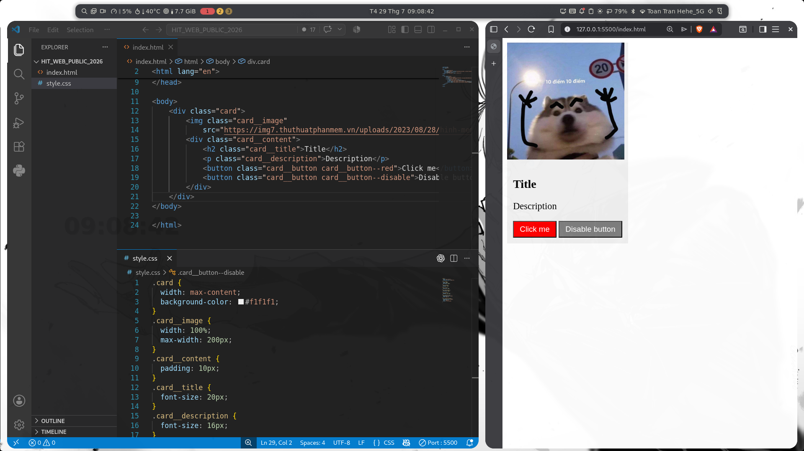

## V. Nhúng Icon, nhúng font
1. Nhúng icon
- Truy cập trang web https://cdnjs.com/libraries/font-awesome, click nút hình ảnh để copy thẻ link (Link Tag)

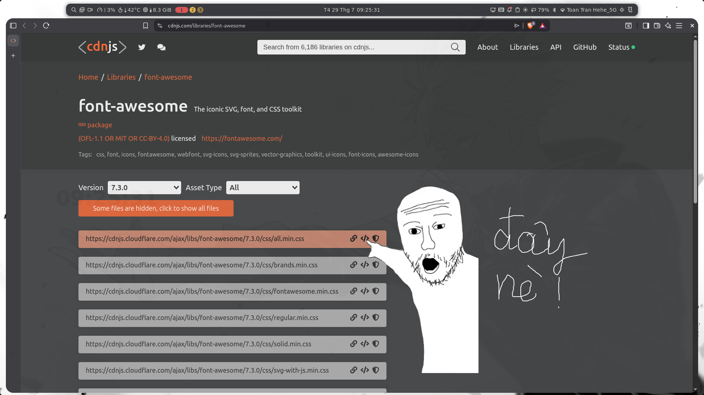

- Paste thẻ link vừa copy được vào bên trong thẻ `<head>` và sau đó truy cập trang web https://fontawesome.com/search?ic=free&o=r để tra icon

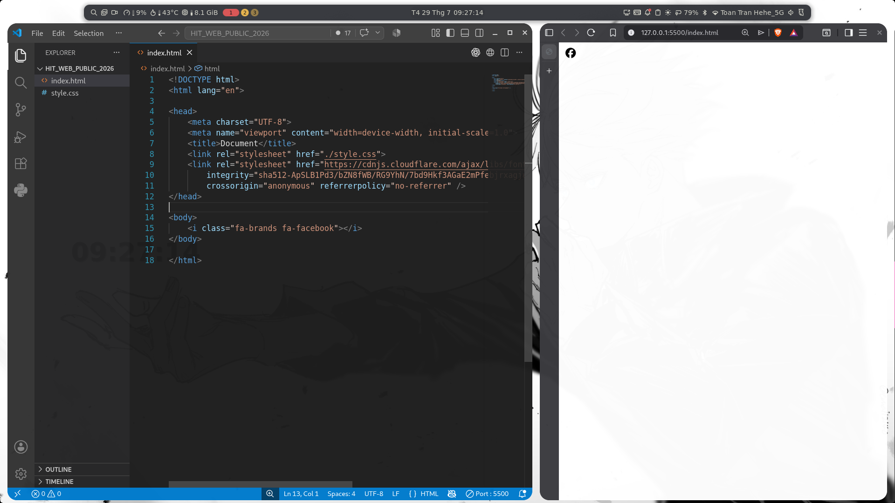

2. Nhúng font

- Truy cập https://fonts.google.com/


### Game giúp bạn master CSS Selector 👉 [tại đây](https://flukeout.github.io/)

---

## VI. Các khái niệm cơ bản trong Flexbox

Flexbox là một công cụ mạnh mẽ trong CSS giúp căn chỉnh, sắp xếp, và phân bổ không gian giữa các phần tử trong một container. Nó đặc biệt hữu ích cho việc tạo bố cục web responsive nhờ sự linh hoạt của nó

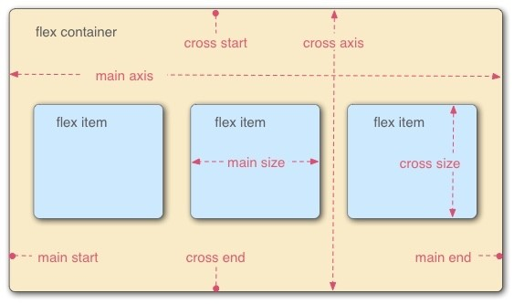

1. **Flex Container**:

   - Là phần tử cha có `display: flex;`. Khi một phần tử trở thành flex container, tất cả các phần tử con trực tiếp của nó sẽ được gọi là **flex items** và được sắp xếp theo các quy tắc của Flexbox.

2. **Flex Item**:

   - Là các phần tử con trực tiếp bên trong một flex container. Các flex items có thể được điều chỉnh và sắp xếp linh hoạt theo trục chính và trục phụ của container.

3. **Main Axis (Trục chính)**:

   - Trục chính là trục mà flex items được sắp xếp theo. Trục chính mặc định là chiều ngang, nhưng có thể thay đổi bằng thuộc tính `flex-direction`.

4. **Cross Axis (Trục phụ)**:

   - Trục vuông góc với trục chính. Trục phụ giúp căn chỉnh các flex items dọc theo chiều vuông góc với trục chính.

5. **Main Size**:

   - Kích thước của một flex item theo chiều của trục chính.

6. **Cross Size**:
   - Kích thước của một flex item theo chiều của trục phụ.

---

### II. Thuộc tính Flexbox

1. **`display: flex;`**

   - Kích hoạt Flexbox cho phần tử, biến nó thành flex container. Các phần tử con của nó sẽ tự động trở thành flex items và chịu tác động của các thuộc tính Flexbox.

   ```css
   .container {
     display: flex;
   }
   ```

2. **`flex-direction`**

   - Xác định hướng sắp xếp của các flex items.
   - Giá trị:
     - `row` (mặc định): Sắp xếp từ trái sang phải.
     - `row-reverse`: Sắp xếp từ phải sang trái.
     - `column`: Sắp xếp từ trên xuống dưới.
     - `column-reverse`: Sắp xếp từ dưới lên trên.
   - **Ví dụ**:
     ```css
     .container {
       display: flex;
       flex-direction: row;
     }
     ```

3. **`justify-content`**

   - Căn chỉnh các flex items dọc theo trục chính.
   - Giá trị:
     - `flex-start`: Căn về đầu trục chính.
     - `flex-end`: Căn về cuối trục chính.
     - `center`: Căn giữa trên trục chính.
     - `space-between`: Khoảng cách đều giữa các items.
     - `space-around`: Khoảng cách đều xung quanh các items (bao gồm cả hai đầu container).
     - `space-evenly`: Khoảng cách bằng nhau giữa các items và các cạnh của container.
   - **Ví dụ**:
     ```css
     .container {
       display: flex;
       justify-content: space-between;
     }
     ```

4. **`align-items`**

   - Căn chỉnh các flex items dọc theo trục phụ.
   - Giá trị:
     - `flex-start`: Căn về đầu trục phụ.
     - `flex-end`: Căn về cuối trục phụ.
     - `center`: Căn giữa trên trục phụ.
     - `baseline`: Căn các items theo baseline của văn bản.
     - `stretch` (mặc định): Các items sẽ giãn đầy container dọc theo trục phụ.
   - **Ví dụ**:
     ```css
     .container {
       display: flex;
       align-items: center;
     }
     ```

5. **`align-content`**

   - Căn chỉnh các dòng của flex items khi có nhiều dòng (chỉ áp dụng khi `flex-wrap: wrap;`).
   - Giá trị:
     - `flex-start`, `flex-end`, `center`, `space-between`, `space-around`, `stretch`.
   - **Ví dụ**:
     ```css
     .container {
       display: flex;
       flex-wrap: wrap;
       align-content: space-around;
     }
     ```

6. **`flex-wrap`**

   - Cho phép các flex items xuống dòng khi container không đủ rộng.
   - Giá trị:
     - `nowrap` (mặc định): Các items nằm trên một dòng duy nhất.
     - `wrap`: Các items sẽ xuống dòng khi không đủ không gian.
     - `wrap-reverse`: Các items xuống dòng nhưng theo thứ tự ngược.
   - **Ví dụ**:
     ```css
     .container {
       display: flex;
       flex-wrap: wrap;
     }
     ```

7. **`gap`**

   - Tạo khoảng cách giữa các flex items.
     - row-gap: khoảng cách giữa mỗi hàng
     - column-gap: khoảng cách giữa mỗi cột
   - **Ví dụ**:
     ```css
     .container {
       display: flex;
       gap: 10px 20px;
       <!--  Khoảng cách giữa hàng là 10px;
        Khoảng cách giữa cột là 20px; -->
     }
     ```

8. **`flex-grow`**

   - Điều chỉnh khả năng mở rộng của flex item khi có không gian trống.
   - Giá trị: Số không âm (mặc định là `0`). Số càng lớn, flex item sẽ càng mở rộng nhiều hơn.
   - **Ví dụ**:
     ```css
     .item {
       flex-grow: 1;
     }
     ```

9. **`flex-shrink`**

   - Điều chỉnh khả năng co lại của flex item khi không đủ không gian.
   - Giá trị: Số không âm (mặc định là `1`). Số càng lớn, flex item sẽ co lại nhiều hơn.
   - **Ví dụ**:
     ```css
     .item {
       flex-shrink: 1;
     }
     ```

10. **`flex-basis`**

    - Thiết lập kích thước ban đầu của flex item trước khi áp dụng `flex-grow` và `flex-shrink`.
    - Giá trị có thể là bất kỳ kích thước hợp lệ nào (px, %, em, v.v.).
    - **Ví dụ**:
      ```css
      .item {
        flex-basis: 200px;
      }
      ```

11. **`align-self`**

    - Căn chỉnh một flex item theo trục phụ, ghi đè thuộc tính `align-items` của container.
    - Giá trị: `auto`, `flex-start`, `flex-end`, `center`, `baseline`, `stretch`.
    - **Ví dụ**:
      ```css
      .item {
        align-self: center;
      }
      ```

12. **`order`**
    - Xác định thứ tự sắp xếp của flex item trong container, mặc định là `0`.
    - Giá trị: Số nguyên (có thể âm).
    - **Ví dụ**:
      ```css
      .item {
        order: -1;
      }
      ```

---

### Ví dụ tổng hợp và trò chơi

👉 [Ví dụ ở đây](https://codepen.io/ndangelo/pen/BaamRam)
👉 [Trò chơi ở đây](https://flexboxfroggy.com/)

